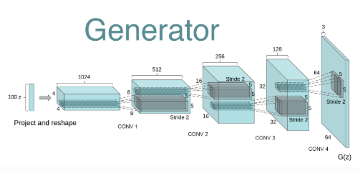
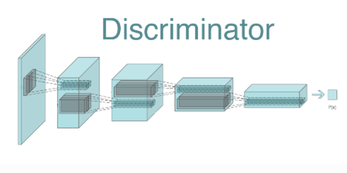
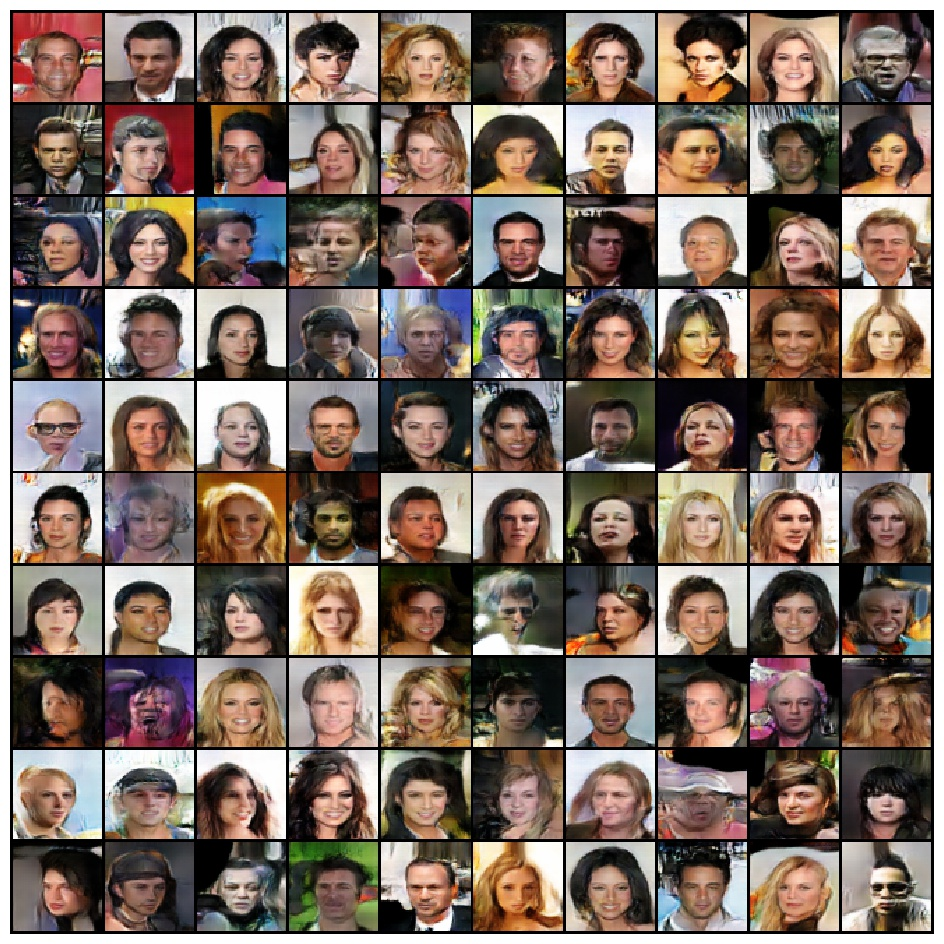

# DCGAN_pytorch
An implementation of Deep Convolutional Generative Adversarial Network, or DCGAN for short.

Paper: https://arxiv.org/pdf/1511.06434.pdf

The DCGAN is a fully convolutional network with all feed-forward layers removed. Each layer in the Discriminator is a convolutional layer and the Discriminator downsizes the image fed through it via strided convolutions. Strided convolutions are preferred over pooling as strided convolutions are operations that the network can tune via learning. Thus they are optimal for DCGAN. The generator takes in a latent noise vector and applies a convolutional tranpose layer (sometimes referred to as deconvolution) to upsample the latent noise vector into the correct dimenion image.

Here are the architecture diagrams given in the paper:

## Generator

## Discriminator

The DCGAN is able to more fluidly learn dynamic images compared to a vanilla feed-forward GAN producing better results. Some examples show quit pleasing going through the batch of generated fake images.

